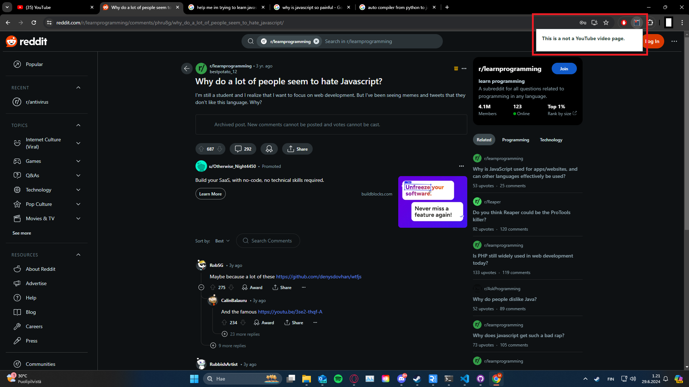
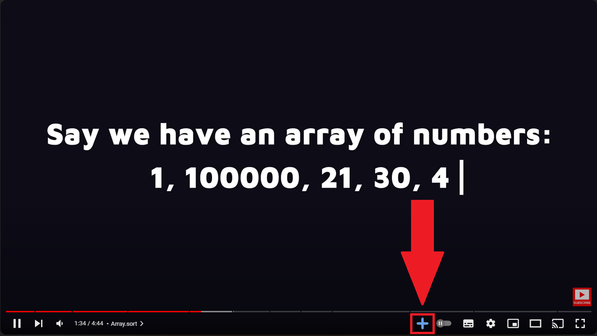
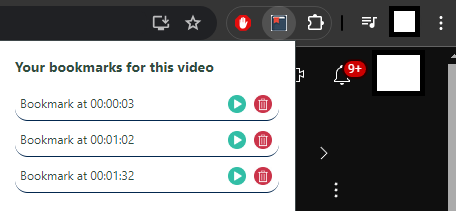
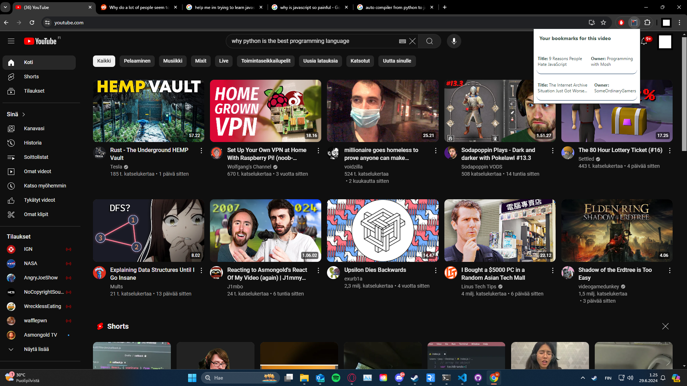

# Youtube Bookmark Extension
> [!NOTE]
> This is a hobby project.

An YouTube video bookmarker, the idea is to be able to create bookmarks for watched videos, save these bookmarks using chrome.storage.

Example of use:
When viewing page that is not an YouTube page we see this:

A simple button added to the control panel of the video (html manipulation)

After adding the bookmarks and clicking the bookmark list (while in the video page), the video bookmarks are visible. (You can edit ("edit"-mode is under construction for now) and remove the bookmarks here)

Empty bookmark list in a video.

When there are saved bookmarks and you are on the main page of YouTube, you can see the videos of which you have added bookmarks to.

When there are no bookmarks saved (but you are on YouTube main page)
